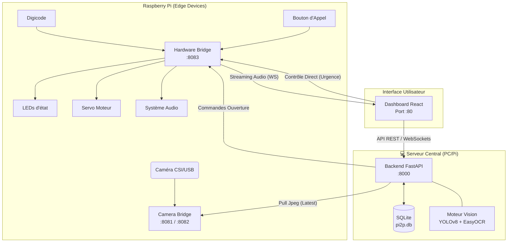

# 🏗️ Architecture Technique - PI2P 2026

Ce document détaille l'organisation systémique et les flux de communication entre les différents modules du projet.

## 📡 Schéma de Communication

Le système est conçu comme une architecture distribuée où le Raspberry Pi gère le matériel (I/O) et le flux vidéo, tandis qu'un serveur (PC ou Pi puissant) gère l'intelligence artificielle.



---

## 🧩 Détails des Composants

### 1. Camera Bridge (`:8081`, `:8082`)
*   **Rôle** : Isoler la capture hardware du traitement logiciel.
*   **Techno** : Python, `rpicam-vid` (CSI) ou `OpenCV` (USB).
*   **Flux** : Expose un endpoint `/latest.jpg` consommé par le Backend et un flux `/stream` (MJPEG) pour le Dashboard.

### 2. Hardware Bridge (`:8083`)
*   **Rôle** : Abstraction de la couche physique GPIO.
*   **Techno** : FastAPI, `gpiozero`.
*   **Fonctions** :
    *   Gestion du Servo (Barrière).
    *   Gestion des LEDs (Vert/Orange/Rouge).
    *   Scanner de clavier (Digicode).
    *   Gestionnaire d'appels (Intercom).

### 3. Backend Central (`:8000`)
*   **Rôle** : Cerveau du système.
*   **Intelligence** :
    *   **YOLOv8** : Détection de véhicules et humains.
    *   **EasyOCR** : Lecture des plaques d'immatriculation.
    *   **Fuzzy Matching** : Comparaison intelligente avec la base de données.
*   **Persistance** : SQLite pour les autorisations et l'historique.

### 4. Dashboard React
*   **Rôle** : Poste de commandement industriel.
*   **Fonctionnalités** :
    *   Surveillance live avec overlays IA.
    *   Gestion de la base de données de plaques.
    *   Logs en temps réel.
    *   Intercom audio bidirectionnel.

---

## 🔌 Protocoles Utilisés

| Lien | Protocole | Usage |
| :--- | :--- | :--- |
| **Frontend ↔ Backend** | HTTP REST / WebSockets | Data & Logs Temps Réel |
| **Backend ↔ Camera Bridge** | HTTP (Pull) | Récupération des frames pour IA |
| **Backend ↔ Hardware Bridge** | HTTP REST | Commande de la barrière |
| **Frontend ↔ Hardware Bridge** | WebSockets | Stream Audio Intercom |
| **Frontend ↔ Camera Bridge** | MJPEG over HTTP | Flux vidéo direct |


---

##  Structure des Dossiers & Bibliothèques

Voici l'organisation du projet avec les principales bibliothèques utilisées pour chaque service :

```text
 PI2P_2026/
├── backend/                   # Cerveau (IA & API Centrale)
│   ├── core/                  # Configuration & Hardware Helpers
│   ├── data/                  # Base SQLite (pi2p.db) & Images
│   ├── routers/               # Routes FastAPI (Accès, Système, Flux)
│   ├── services/              # VisionProcessor (YOLOv8, EasyOCR)
│   └── requirements.txt       # [fastapi, ultralytics, easyocr, requests]
│
├── frontend/                  # Dashboard (React 19)
│   ├── src/
│   │   ├── components/        # UI (Vues Dashboard, Logs, Database)
│   │   ├── routes/            # AppRouter (Navigation)
│   │   └── App.jsx            # State Central & WebSockets
│   └── package.json           # [react, vite, tailwindcss, lucide-react]
│
├── camera-bridge/             # Streamer Vidéo (CSI & USB)
│   ├── bridge.py              # Capture CSI (rpicam-vid)
│   ├── bridge_usb.py          # Capture USB (OpenCV)
│   └── Dockerfile             # [opencv-python]
│
├── hardware-bridge/           # Contrôleur GPIO (Modular)
│   ├── core/                  # Audio (aplay), Hardware (gpiozero)
│   ├── routers/               # Servo, Keypad (Digicode), Intercom
│   └── main.py                # Serveur FastAPI local au Pi
│
└── config/                    # Configuration Partagée
    └── settings.json          # Paramètres IA, Hardware & Modes Barrière
```