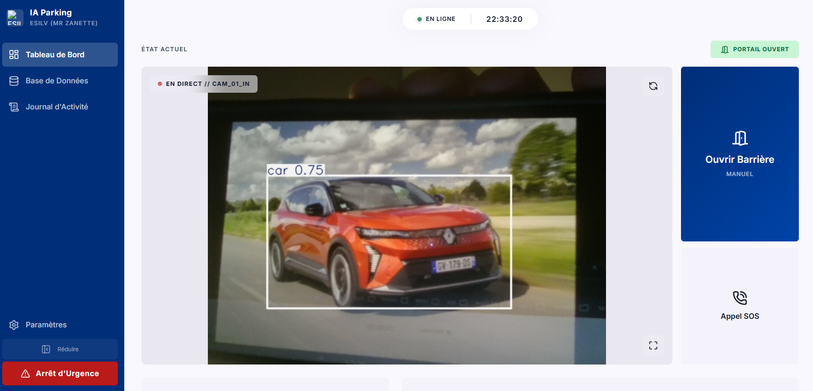
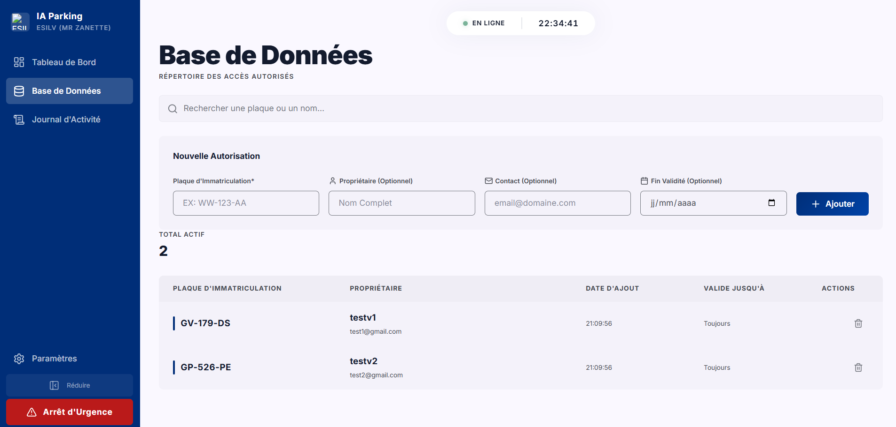
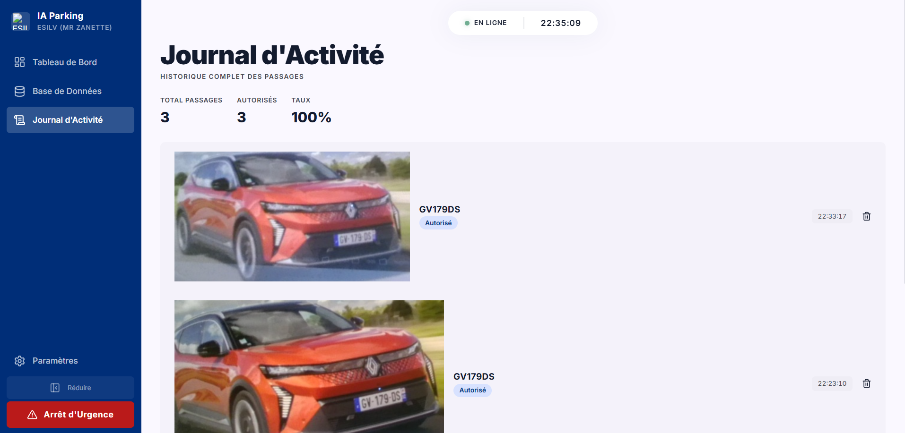

# 🅿️ PI2P 2026 - Central Command Center (Groupe 3309)

[](#)
[](#)
[](#)
[](#)

Système de gestion de parking intelligent de nouvelle génération. Alie la puissance de la vision par ordinateur (YOLOv8) à une interface de commandement industrielle pour une gestion fluide des accès ESILV.

## 🌟 Nouvelles Fonctionnalités (v2.0)

- **Command Center Unifié :** Interface full-screen avec flux vidéo 30 FPS et annotations IA en temps réel.
- **Base de Données Centralisée (SQLite) :** Migration des fichiers JSON vers une base `pi2p.db` robuste gérant les plaques, les noms, les emails et les dates de validité.
- **Gestion Expirelle :** Autorisations temporaires avec suppression automatique ou blocage à expiration.
- **Système de Surcharge Hardware (Override) :** 
    - `Auto` : IA pilotée par plaques.
    - `Always Open` : Forçage physique du relai (Pin 17) ouvert.
    - `Always Closed` : Blocage de sécurité de toute intrusion.
- **Code d'Entrée Physique :** Digicode numérique configurable depuis le dashboard.
- **IA Modulaire :** Choisissez en temps réel ce que l'IA doit surveiller (Voitures, Motos, Personnes, Animaux).

## 🛠️ Tech Stack

### 🧠 Backend (IA & API)
- **Framework :** [FastAPI](https://fastapi.tiangolo.com/) (Python 3.11+)
- **Vision par ordinateur :** [YOLOv8](https://ultralytics.com/) & [EasyOCR](https://github.com/JaidedAI/EasyOCR)
- **Base de données :** SQLite (Gestion des plaques, utilisateurs et historique)
- **Matériel :** `gpiozero` pour le contrôle des relais et digicodes.

### 💻 Frontend (Dashboard)
- **Framework :** [React 19](https://react.dev/) + [Vite](https://vitejs.dev/)
- **Style :** [Tailwind CSS 4](https://tailwindcss.com/)
- **Icônes :** Lucide React

### 📹 Infrastructure Caméra (Bridge)
- **Capture CSI :** `rpicam-vid` (Caméra nappe OV5647)
- **Capture USB :** OpenCV (Webcam WCAM100BK)
- **Protocol :** Flux MJPEG over HTTP pour une latence minimale.

---

## 🗂️ Architecture du Projet

```text
├── backend/
│   ├── Data/                 # Base SQLite (pi2p.db)
│   ├── core/                 # Hardware (GPIO, Pin 17) & Config
│   ├── services/             # VisionProcessor (YOLO + OCR dynamique)
│   ├── routers/              # API REST & WebSockets (Live Data)
│   └── main.py               # Point d'entrée FastAPI
├── camera-bridge/
│   ├── bridge.py             # Streamer pour caméra CSI
│   └── bridge_usb.py         # Streamer pour caméra USB
├── frontend/
│   ├── src/
│   │   ├── components/       # UI Components & Views
│   │   ├── routes/           # Système de navigation modulaire
│   │   └── App.jsx           # Gestion d'état & WebSockets
│   └── nginx.conf            # Config serveur de production
├── config/
│   └── settings.json         # Paramètres hardware & IA
└── docker-compose.yml        # Orchestration multi-services
```

## 🚀 Installation Express

### 1. Backend (Python 3.11+)
```bash
cd backend
python -m venv .venv
.\.venv\Scripts\activate # Windows
pip install -r requirements.txt
uvicorn main:app --reload
```

### 2. Frontend (Node.js)
```bash
cd frontend
npm install
npm run dev
```

## 🛠️ Utilisation du Command Center

1. **Dashboard** : Surveillez le flux vidéo. Le bouton "Ouvrir" force l'ouverture logicielle pour 5 secondes.
2. **Base de Données** : Enregistrez les véhicules autorisés avec leurs coordonnées.
3. **Paramètres** : 
    - Changez le **Gate Mode** pour forcer le portail ouvert lors d'un événement.
    - Configurez les objets à détecter (ex: activer la détection "Personne" pour la sécurité nocturne).
    - Modifiez le code PIN du digicode.

## 🐳 Docker
Le projet est prêt pour le déploiement industriel via Docker Compose sur Raspberry Pi 4.
```bash
docker-compose up --build -d
```


# Screenshots

Le tableau de bord:  



La base de données:  



Le Journal d'activité:  




---
*Projet réalisé dans le cadre de l'A3 PI2P à l'ESILV par le Groupe 3309.*